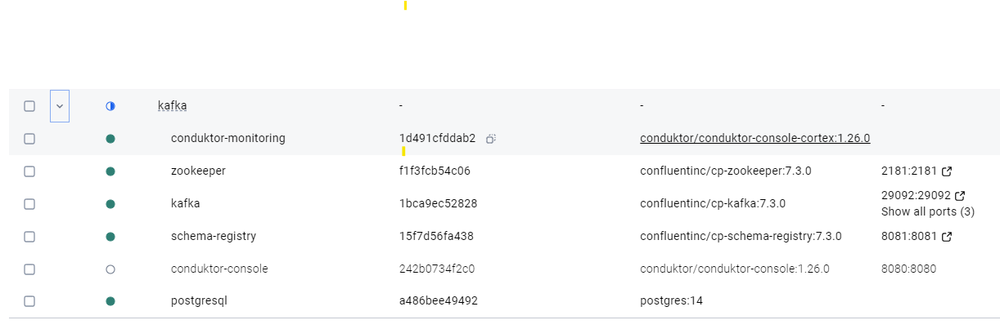

# KafkaModule
## Environment Setup
### 1. Online lab 💲
- kk: https://kode.wiki/4q4V7VZ paid / Apache Kafka
- Watch lab here: https://www.youtube.com/watch?v=9mNYokzTD14 - netflix examples
- apache kafka + kafDrop UI
- watched once, no need to watch again.
- scenarios: producer, consumer, alter partions 3 to 6, hence more through-put, set retention policies,

### 2. Docker Compose 1
- Kafka cluster + Zookeeper + Schema Registry + Conduktor Console already running.
- [docker-compose.yml](../../../../resources/more/kafka/docker-compose.yml)
- [platform-config.yml](../../../../resources/more/kafka/platform-config.yml)
- cluster name: `my-local-kafka-cluster`
- https://conduktor.io/get-started

```bash
cd ./../../../resources/more/kafka
```
```bash
docker-compose -f docker-compose.yml up -d
```

- fix for cnductor-console 👈🏻
```yaml
  conduktor-console:
    image: conduktor/conduktor-console:1.26.0
    hostname: conduktor-console
    container_name: conduktor-console
    depends_on:
      - postgresql
    ports:
      - "8080:8080"
    volumes:
      - type: bind
        source: "/c/Users/Manisha/Documents/github-2025/microservice-java/src/main/resources/more/kafka/platform-config.yml" # update this path 👈🏻👈🏻
        target: /opt/conduktor/platform-config.yaml
        read_only: true
    environment:
      CDK_IN_CONF_FILE: /opt/conduktor/platform-config.yaml
```

```text
[+] Running 7/7 ✅
 ✔ Network kafka_default           Created                                                                                                                                                                                 0.0s 
 ✔ Container zookeeper             Started                                                                                                                                                                                 1.6s 
 ✔ Container conduktor-monitoring  Started                                                                                                                                                                                 1.6s 
 ✔ Container postgresql            Started                                                                                                                                                                                 1.5s 
 ✔ Container conduktor-console     Started                                                                                                                                                                                 1.5s 
 ✔ Container kafka                 Started                                                                                                                                                                                 1.6s 
 ✔ Container schema-registry       Started
```



---
### 3. Docker Compose 2
- **curl -L https://releases.conduktor.io/quick-start -o docker-compose.yml && docker compose up -d --wait && echo "Conduktor started on http://localhost:8080"**
- https://github.com/conduktor/kafka-beginners-course/tree/main/conduktor-platform - worked(old one)
- next:
    - for new update: https://conduktor.io/get-started
    - check all container: https://releases.conduktor.io/quick-start -o docker-compose.yml
    - launch UI/conduktor : http://localhost:8080
 
---
