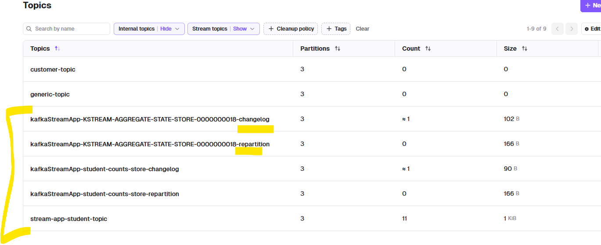

## Kafka ProducerConsumer API Demo

### POC
- Kafka Streams DSL (high-level)
- Build real-time stream processing applications using Kafka Streams API with Spring Boot.
- Process data in motion, perform transformations, aggregations, and joins on streaming data.
- Leverage Kafka's scalability and fault-tolerance for robust stream processing.
- **JsonSerde** for serialization/deserialization. 👈🏻
  - This POC uses JSON serde (Spring's JsonSerde)
  
### Scenarios
- stream-process-app-1 (consumer-group-1) - gets all 3 partition.
- stream-process-app-1/2/3 (consumer-group-1) - each gets 1 partition.
  - use same application.id :)
  - start same instance multiple times.
  - parallelism == no of partitions. (hard truth)
- Run app > send some event > stop it > restart > see state restored from changelog topic.

### overview
- env setup: [README_env_setup.md](../README_env_setup.md)
- reference: 
  - https://www.youtube.com/watch?v=U7RZcBtP6Dw&list=PLVz2XdJiJQxz55LcpHFM6QIB-Px40w3Gt&index=4
  - https://chatgpt.com/c/6951ccd9-ddac-8333-a10e-28ed6ebec776
- main: [kafkaStreamApp.java](kafkaStreamApp.java)
  - [KafkaStreamService.java](KafkaStreamService.java) has KStreams<K,V> operations 👈🏻

- props: [application.yml](../../../../resources/application.yml)
- conductor console: http://localhost:8080/console/my-local-kafka-cluster
- `@EnableKafkaStreams`
- topics:
  - input: **stream-app-student-topic**
  - output: **stream-app-student-topic-processed**

### API endpoints
- Swagger docs: http://localhost:8092/kafkaStreamApp/swagger-ui/index.html 👈🏻
- GET http://localhost:8092/management/streams/health
  - can Add **Actuator** and wire the streams health into /actuator/health.
- POST http://localhost:8092/api/v1/students/publish
- POST http://localhost:8092/api/v1/students/publish-streams/{count}

### Commands
- Start the app (from KafkaModule directory):
```powershell
mvn -pl KafkaModule -am -DskipTests spring-boot:run
```

- Publish a test message:
```powershell
curl -X POST -H "Content-Type: application/json" -d '{"id":"1","name":"lekhraj kumar","age":25}' http://localhost:8092/api/v1/students/publish
```

- Consume the output topic:
```powershell
kafka-console-consumer --bootstrap-server localhost:9092 --topic stream-app-student-topic-processed --from-beginning
```

### Stream Operations
#### Stateless
- **filter**
    Keep only records matching a predicate.
```Java    
        KStream<String, StudentJson> students = builder.stream("stream-app-student-topic");
        KStream<String, StudentJson> adults = students.filter((k, v) -> v != null && v.getAge() >= 18);
```
- **mapValues**
    Transform only the value, preserving the key.
```Java   
        KStream<String, StudentJson> upper = adults.mapValues(s -> { s.setName(s.getName().toUpperCase()); return s; });
```
- **map**
    Transform both key and value (or change the key).
```Java    
        KStream<String, StudentJson> keyedByName = upper.map((k, v) -> KeyValue.pair(v.getName(), v));
```

- **flatMapValues**
    Expand a value into zero or more values (useful for splitting).
```Java    
        KStream<String, String> nameParts = keyedByName.flatMapValues(s -> Arrays.asList(s.getName().split("\\s+")));
```
- **peek**
    Side-effect operation useful for logging or metrics (doesn't modify stream).
```Java    
        nameParts.peek((k, v) -> System.out.println("name-part: key=" + k + " value=" + v));
```
- **branch**
    Split stream into multiple streams by predicates.
```Java    
        KStream<String, StudentJson>[] branches = students.branch(
            (k, v) -> v.getAge() < 18,
            (k, v) -> v.getAge() >= 18
        );
```        
#### Stateful



- **groupBy / aggregate / count** 
    Aggregate or count by key (creates a KTable).
 ```Java   
    //Example (count students by name):
        KTable<String, Long> counts = students
            .map((k, v) -> KeyValue.pair(v.getName(), v))
            .groupByKey(Grouped.with(Serdes.String(), new JsonSerde<>(StudentJson.class)))
            .count(Materialized.as("student-counts-store"));

 // bts, sens KTable updates as a stream to a readable topic.
 // students.toStream().to("student-counts-topic", Produced.with(Serdes.String(), Serdes.Long()));
```
- **windowed counts**
    Example (tumbling window 5 minutes):
```Java
        TimeWindows tumbling = TimeWindows.ofSizeWithNoGrace(Duration.ofMinutes(5));
        KTable<Windowed<String>, Long> windowedCounts = students
            .map((k, v) -> KeyValue.pair(v.getName(), v))
            .groupByKey(Grouped.with(Serdes.String(), new JsonSerde<>(StudentJson.class)))
            .windowedBy(tumbling)
            .count();
```
- **joins (stream-stream)**
    Join two streams when keys match within a time window.
```Java    
        KStream<String, EnrichedStudent> enriched = students.join(
            otherStream,
            (left, right) -> new EnrichedStudent(left, right.getExtra()),
            JoinWindows.ofTimeDifferenceWithNoGrace(Duration.ofMinutes(2)),
            StreamJoined.with(Serdes.String(), new JsonSerde<>(StudentJson.class), new JsonSerde<>(Other.class))
        );
```
- **transform / transformValues**
    Use when you need access to state stores or custom processing (stateful).
 ```Java   
        KStream<String, StudentJson> transformed = students.transform(() -> new MyTransformer(), "my-state-store");
```
- **to (send to output topic)**
```Java 
        dtoStream.to("stream-app-student-topic-processed", Produced.with(Serdes.String(), new JsonSerde<>(StudentDto.class)));
```

- Side Notes:
  - Use `JsonSerde` (Spring's JsonSerde) for JSON serialization/deserialization of POJOs.
  - Materialize stateful operations with `Materialized.as("store-name")` to enable state stores and interactive queries.
  - Choose `groupBy` vs `groupByKey` depending on whether you change the key prior to aggregation.
  - Keep stream operations immutable: each operation returns a new KStream/KTable.

