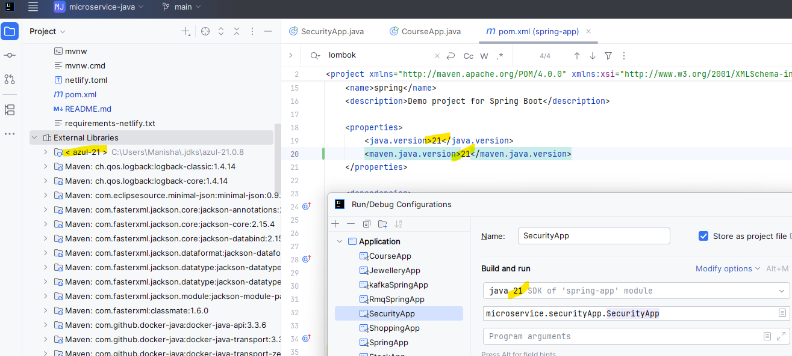

# java | springboot | microservices | kafka | rmq | spring-batch

## ✔️ documentation
- `mkdocs` 
  ```bash
  .\mkdocs\.venv\Scripts\activate
  pip install -r requirements-netlify.txt
  mkdocs serve
  ```
---
## ✔️CD/CI
- Deployment steps: https://github.com/lekhrajdinkar/microservice-java/blob/main/helm/readme.md

---
## ✔️POCs / projects
### 🔸leetcode
https://leetcode.com/u/lekhrajdinkar/

### 🔸Java7+ project
- [JavaSpringApp README.md](src/main/java/evolution/javaSpringApp/README.md)
- [java evolution - project and Notes](src/main/java/evolution)
  - [Java 7 README.md](src/main/java/evolution/java_7/README.md)
  - [Java 8 README.md](src/main/java/evolution/java_8/README.md)
  - [Java 11 README.md](src/main/java/evolution/java_11/README.md)
  - [Java 17 README.md](src/main/java/evolution/java_17/README.md)
  - [Java 21 README.md](src/main/java/evolution/Java_21/README.md)
  - [Java 25 README.md](src/main/java/evolution/java_25/README.md)
  - ...
- [Advance concepts Notes📚](docs/03_Advance)
  
### 🔸SpringBoot App
- [Notes 📚](docs/02_springboot)
- [Spring_01_AOP](src/main/java/springbootApp/AOP)
- [Spring_02_Core](src/main/java/springbootApp/SpringCore)
- [Spring_03_Properties](src/main/java/springbootApp/SpringProperties)
- [Spring_04_AutoConfiguration](src/main/java/springbootApp/SpringAutoConfiguration)
- ...

### 🔸micro-services projects
- 📚 check `readme.md` ( in each project for more **details** )
- Web basic App  
  - [jewelleryApp](src/main/java/microservice/basicWebApp/jewelleryApp) - restApi(no DB, h/c), swagger doc, servlet, webServer, jackson, error handling, caching response, etc
  - [courseApp](src/main/java/microservice/basicWebApp/courseApp) - h2, hibernate more, txn, tuple, pagination, etc
- [modern Web App](src/main/java/microservice/modernWebApp)
  - [shoppingApp](src/main/java/microservice/modernWebApp/shoppingApp) - ASGI, Async, websocket, grpc
  - [stockApp](src/main/java/microservice/modernWebApp/stockApp) - streaming, modulith, temporal
- More
  - [security App](src/main/java/microservice/securityApp) | OAuth2, okta, jwt, basic
  - [observability App](src/main/java/microservice/observabilityApp) - otel, aws-x-rays

### 🔸MessageBroker projects
- [📚 Notes](https://github.com/lekhrajdinkar/solution-engineer/tree/main/docs/06_message-broker)
- [kafka](src/main/java/more)
- [rmq](src/main/java/more/rmq)
- **ETL/Spring-Batch**  | [Notes 📚](docs/02_springboot/05_spring-batch-ETL)  | [springbatch](src/main/java/more/springbatch)

---
## ✔️ other/s
```
--spring.config.location=classpath:/custom-config.properties
--spring.config.additional-location=classpath:/custom-config.properties

--spring.profiles.active=dev

👉 Priority Rule:
Order of property resolution (highest wins):
  Command-line args (--key=value)
  spring.config.location file(s)
  spring.config.additional-location file(s)
  application-{profile}.properties
  application.properties
```

- Set/update **java Runtime**
```
#1 pom.xml
<properties>
   <java.version>21</java.version>
   <maven.java.version>21</maven.java.version>
</properties>

#2  InteliJ    
- File → Project Structure → SDKs
- Set this as Project SDK and Module SDK
- In Settings → Build, Execution, Deployment → Compiler → Java Compiler, ensure:
    Use compiler: javac
    Target bytecode: 25 (or lower if compatibility needed)
- Check java version on runtime config for each app and validate java

---cmd-----
mvn clean compile
mvn -v
java -version
javac -version

--- Status--- (as of Sep 2025) 
java 21 : working ✔️
java 23 : Lombok not supported ❌
java 25 : Maven not supported ❌

```



