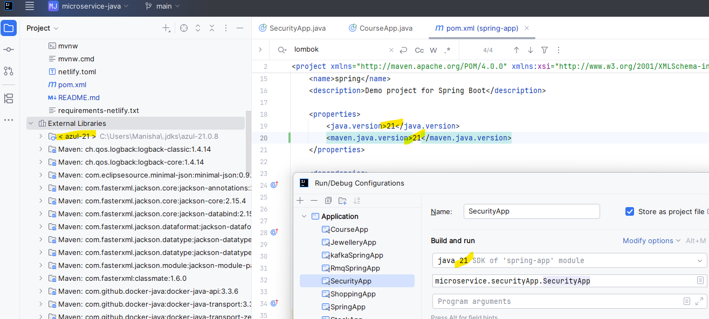

# Java system | [Leetcode](https://leetcode.com/u/lekhrajdinkar/)
> Java | Spring boot | microServices | kafka | rmq | spring-batch | SpringAI

---
## Docs by year
- [2012-2026](docs/2012-2026)

---
## Side Notes

<details>
<summary>Click to expand</summary>

```
--spring.config.location=classpath:/custom-config.properties
--spring.config.additional-location=classpath:/custom-config.properties

--spring.profiles.active=dev

👉 Priority Rule:
Order of property resolution (highest wins):
  Command-line args (--key=value)
  spring.config.location file(s)
  spring.config.additional-location file(s)
  application-{profile}.properties
  application.properties
```

- Set/update **java Runtime**
```
#1 pom.xml
<properties
   <java.version21</java.version
   <maven.java.version21</maven.java.version
</properties

#2  InteliJ    
- File → Project Structure → SDKs
- Set this as Project SDK and Module SDK
- In Settings → Build, Execution, Deployment → Compiler → Java Compiler, ensure:
    Use compiler: javac
    Target bytecode: 25 (or lower if compatibility needed)
- Check java version on runtime config for each app and validate java
- use maven wrapper  update it for InteliJ

# maven warpper
- [toolchains.xml](.mvn/toolchains.xml)  update hardcoded java path

---cmd-----
mvn clean compile
mvn -v
java -version
javac -version

--- Status--- (as of Sep 2025) 
java 21 : working ✔️
java 23 : Lombok not supported ❌
java 25 : Maven not supported ❌

--- More
- <!-- 🔶 Security -- comment this part in pom.xml(root)
```



</details>


