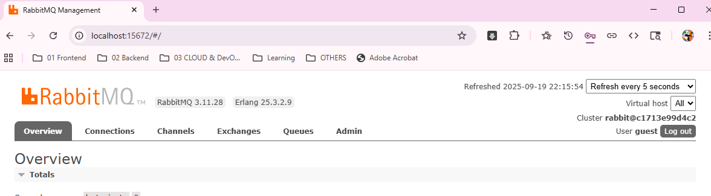
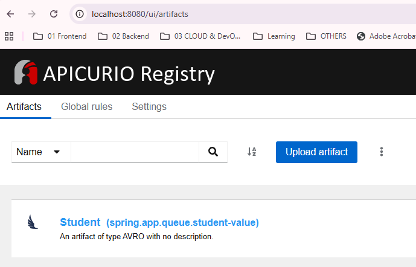

# RabbitMQ Module
- https://www.rabbitmq.com/tutorials
- https://chatgpt.com/c/68ce348e-9b24-8330-8faf-6036616d5006 | AMQP 

---
## Run
- API docs: http://localhost:8095/RmqSpringApp/swagger-ui/index.html
- props : [RmqSpringApp.properties](src/main/resources/more/rmq/RmqSpringApp.properties)
- main class : [RmqSpringApp.java](src/main/java/rmq/RmqSpringApp.java)
-  `mvn spring-boot:run -Dspring-boot.run.profiles=rmq`

---
## Environment setup

```bash
docker run -d --hostname my-rabbit --name some-rabbit -p 5672:5672 -p 15672:15672 rabbitmq:3-management
```
```bash
cd ./../../../../../src/main/resources/more/rmq
docker-compose -f docker-compose.yml up -d
```
- RMQ Management console UI : http://localhost:15672/#/ 



- Apicurio Registry : http://localhost:8080/ui/artifacts



---
## POC
### Consumer
- **1 Manual ack/nack**
```java
@RabbitListener(queues = "${rabbit.mq.queue}", ackMode = "MANUAL")
public void receive(Message message, Channel channel) throws Exception
{
  try {
    String body = new String(message.getBody());
    log.info("Processing: {}", body);

    if (body.contains("fail")) throw new RuntimeException("Simulated failure");
    channel.basicAck(message.getMessageProperties().getDeliveryTag(), false); //✅
  } catch (Exception e) {
    log.error("Error: {}", e.getMessage());
    channel.basicNack(message.getMessageProperties().getDeliveryTag(), false, false); // ❌
  }
 } 
```
- **2 concurrency + prefetch** 
  - each consumer(2) only gets 5 unacked messages max)
```properties
spring.rabbitmq.listener.simple.prefetch=5
spring.rabbitmq.listener.simple.concurrency=2
```

- 3 dead letter exchange (DLX)

- 4 schema validation
  - JSON Schema validation inside consumer ❌
  - avro schema with Apicurio Registry ✔️
