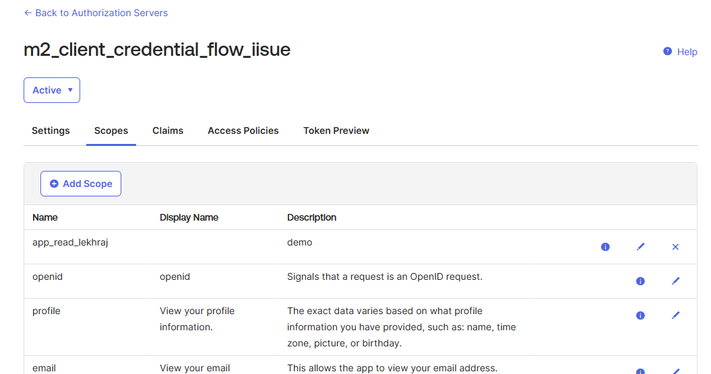
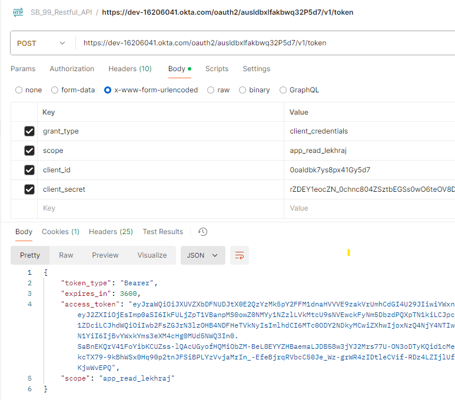

- reference: 
  - okta : https://chatgpt.com/c/7db419de-fa44-4403-b587-a0e849b35ce8
  - my OAuth2 dev account : https://dev-16206041-admin.okta.com/admin/apps/active

- AWS OKTA SAML :
  - https://saml-doc.okta.com/SAML_Docs/How-to-Configure-SAML-2.0-for-Amazon-Web-Service
  - https://help.okta.com/en-us/content/topics/deploymentguides/aws/aws-configure-aws-app.html
  
- [OktaOAuth2ClientConfiguration.java](..%2F..%2Fsrc%2Fmain%2Fjava%2Fcom%2Flekhraj%2Fjava%2Fspring%2FSB_99_RESTful_API%2Fconfiguration%2FOktaOAuth2ClientConfiguration.java)
---
# pre-things
## JWT
- body/payload : claims (statement about user and additional info)

## Application arch
- server-side microservice applications (SpringMVC, JSP) :
- browser-based applications / SPA :
- native/mobile apps :
- connected devices (M2M, lambda) :

## OpenId Connect
- Token based Authentication.  `ID-Token`
- extension over OAuth2.

--- 
# OAuth2
## Intro
- http-redirection (header :: `location=url-2`, responseCode :: `302`)
- refer : https://auth0.com/intro-to-iam/what-is-oauth-2
- Definition : OAuth standard protocol to solve `Delegated Authorization`.
    > - allow appl(Client) to access resources hosted by other microservice apps, on behalf of a user/resource-owner.
    > - provides consented access.
    > - restricts actions of what the client app can perform on resources, without sharing user credential.

- Token based Authorization. `Access-Token` + `Refresh Token` (long expiry )
- Token based:
  - format : JWT. 
  - token/s with multiple scope. (roles)
  - received on callback URI
  - OAuth 2.0 doesn’t define a specific format for Access Tokens

- client must identify/authenticate itself, when requesting an Access Token.
- Resource server (spring-backend-app) 
  - must validate JWT 
  - has role-based access code.

## Key Components :
> Eg: photoPrint-App <--> Google-Drive

- **resource-Owner** (User)
- **Client**
- **resource-Server**
- **Authorization-Server**
- more:
  - **Scopes**
    - specify exactly the `reason`, for which access to resources may be granted.
    - dependent on the Resource Server.
    - while making Auth request mention `scopes`. eg: openid, profile, email, offline_access
    - returned token will have `claims`.
    
  - **Authorization Code**
    - OAuth 2 Authorization server may not directly return an Access Token.
    - Instead, and for better security, an Authorization Code may be returned, which is then exchanged for an Access Token.
  - **Grant Types** 
    - grants are the `set of steps` a Client has to perform to get "resource-access-authorization".
    - check below for detail.
  - **claims**
    - Registered claims:  iss (issuer), exp (expiration time), sub (subject), aud (audience),
    - https://datatracker.ietf.org/doc/html/rfc7519#section-4.1
    - public claims : https://www.iana.org/assignments/jwt/jwt.xhtml
    - private claims :

## Grant Types (flows)
- grants are the "set of steps" a Client has to perform to get "resource-access-authorization".

### `Authorization Code` Grant  with/without PKCE
- https://developer.okta.com/docs/guides/sign-into-web-app-redirect/spring-boot/main/
- After validating client identity,
- AuthServer return single-use Authorization-Code to the Client via callback URI
- which is then exchanged for an Access Token.
- use-case : Traditional microservice apps where the exchange can `securely` happen on the server side. // back-channel.
- **PKCE** : additional steps that make it more secure for mobile/native apps and SPAs.
```
    1. Client : GET /authorize?response_type=code&client_id=`CLIENT_ID`&redirect_uri=`REDIRECT_URI`&scope=read&state=xyz
    2. OKTA : HTTP/1.1 302 Found Location: https://client-app.com/callback?code=`AUTHORIZATION_CODE`&state=xyz
    3. Client : POST /token 
       Content-Type: application/x-www-form-urlencoded
       grant_type=authorization_code&code=AUTHORIZATION_CODE&redirect_uri=REDIRECT_URI&client_id=CLIENT_ID&client_secret=CLIENT_SECRET
```

### `Implicit` Grant
- A simplified flow where the Access Token is returned "directly" to the Client.
- use-case : SPA.

### `client-credential` Grant
- First client acquire its own credentials(client id, client secret) from the Authorization Server,
- Access Token is returned against these credential. (basically AuthServer validate identity.)
- use-case : lambda, micro services.
- https://developer.okta.com/blog/2021/05/05/client-credentials-spring-security
- **hands on**:
  - created app / client https://dev-16206041-admin.okta.com/admin/app/oidc_client/instance/0oaldbk7ys8px41Gy5d7/#tab-general
  - created auth server: https://dev-16206041-admin.okta.com/admin/oauth2/as/ausldbxlfakbwq32P5d7#
    - add scope :  app_read_lekhraj
    - add Access policy : allow above client
    - **DPoP** : disable
    - can add Trusted-servers
  - made postman call : https://lekhrajdinkar-postman-team.postman.co/workspace/My-Workspace~355328d1-2f75-4558-8e56-e229e284f6a3/example/5083106-53c3fa91-ef5f-4f49-899f-2b1064386242
  - created GET http://localhost:8083/spring/security/getAccessToken to do same.
```
    {
  "ver": 1,
  "jti": "AT.-DVBDB63tr7t34AlwXR_y3zT_mHZWpGPWxholPDGLfI",
  "iss": "https://dev-16206041.okta.com/oauth2/ausldbxlfakbwq32P5d7",
  "aud": "0oaldbk7ys8px41Gy5d7",
  "iat": 1732406655,
  "exp": 1732410255,
  "cid": "0oaldbk7ys8px41Gy5d7",
  "scp": [
  "app_read_lekhraj"                         <<<<<<
  ],
  "sub": "0oaldbk7ys8px41Gy5d7"
  }
  
got exception: 
  - org.springframework.security.oauth2.core.OAuth2AuthorizationException: [invalid_dpop_proof] The **DPoP proof JWT header is missing**. 
  - Demonstration of Proof of Possession
  - provides an additional layer of security by requiring the client to prove possession of a private key associated.
  - Disable it of Authorizarion-server 
```

### `Refresh Token` Grant
- involves the exchange of a Refresh Token for a new Access Token.

---
## screenshots:








