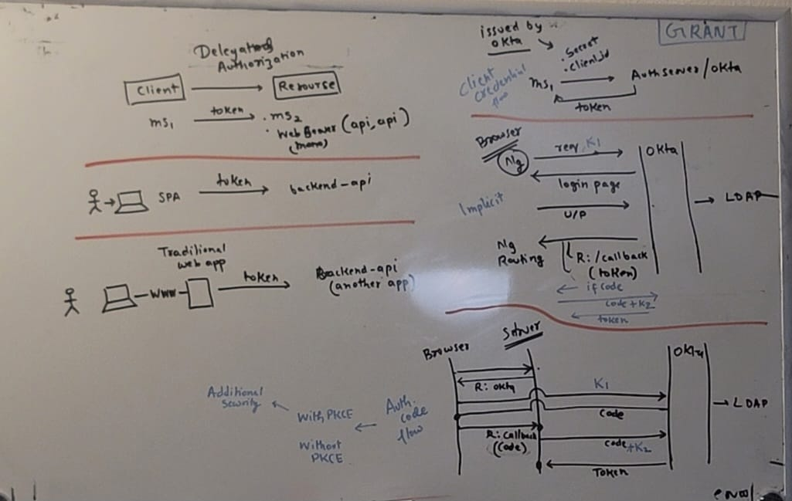
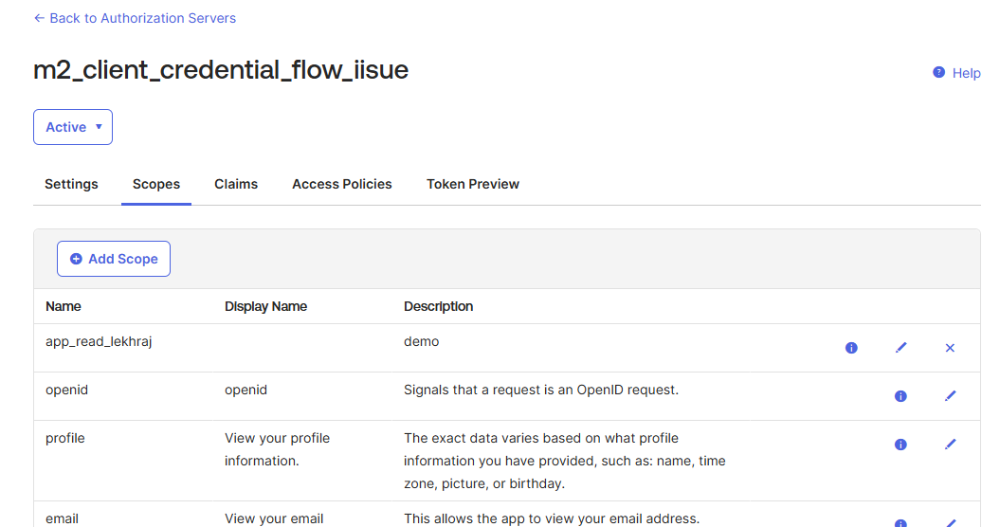
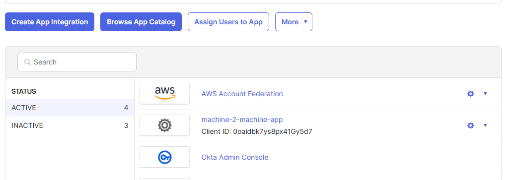

## OAuth2.1
### Intro
- https://auth0.com/intro-to-iam/what-is-oauth-2
- OAuth standard protocol to solve **Delegated Authorization**
    - allow appl(Client) to access resources hosted by other microservice apps, on behalf of a user/resource-owner.
    - provides **consented access**.
    - restricts actions of what the client app can perform on resources, without sharing user credential.
- **token** based protocol | **http-redirection** based protocol
  - (header : `location=url-2`, responseCode :: `301/302`)  

### Key Components 1
- **▶️resource-Owner** (User)
  -  client must identify/authenticate itself first, then requesting an Access Token. 👈🏻
- **▶️Client (app-spa)**
  - SPA
  - mobile-App
  - CLI commands
- **▶️resource-Server (app-api)**
  - must validate JWT with okta
  - grabs roles for RBAC.
  - etc
- **▶️Authorization-Server (okta)**
  - spring-backend-app(via dependency : `spring-boot-starter-oauth2-resource-server`) 
  - or, centralized SaaS app like **OKTA**
  
### Key Components 2
- **▶️Authorization Code**
  - OAuth 2 Authorization server may not directly return an **Access Token**.
  - Instead, and for better security, an **Authorization Code** may be returned, 
  - which is then exchanged for an Access Token.
  - front channel / back channel
- **▶️PKCE** 
  - proof key for code exchange 
  - random String -> CV (`Code verifier`)
  - hashed value  of CV with RSA algo -> CC (`code challenger`)
  - Flow (2 steps):
    - code req (attach CC / hashed value of CV)
    - Auth server, keeps CC
    - token req (attach CV)
- **▶️Token**
  - Access-Token + Refresh Token (long expiry)
  - token format : JWT
  - multiple token each app - token/s with **multiple scope**. (roles)
  - token received on redirected **callback URI**
- **▶️Scopes**
  - specify exactly the **reason**, for which access to resources may be granted.
  - while making Auth request mention scopes. 
    - `openid`, `profile`, `email`, `offline_access`
    - `custom_scope_1`
  - returned token will have `claims` 👈🏻
- **▶️claims**
  - **Registered claims**:  
    - `iss` (issuer), 
    - `exp` (expiration time), 
    - `sub` (subject), 
    - `aud` (audience),
    - ...
    - more: https://datatracker.ietf.org/doc/html/rfc7519#section-4.1
  - public claims : https://www.iana.org/assignments/jwt/jwt.xhtml
  - private claims :
- **▶️Grant Types**
  - grants are the `set of steps` a Client has to perform to get "resource-access-authorization".

### Grant Types (detailed)
#### ✔️`Authorization Code` Grant  with/without PKCE
- https://developer.okta.com/docs/guides/sign-into-web-app-redirect/spring-boot/main/
- After validating client identity,
- AuthServer return single-use Authorization-Code to the Client via callback URI
- which is then exchanged for an Access Token.
- use-case : Traditional microservice apps where the exchange can `securely` happen on the server side. // back-channel.
- **PKCE** : additional steps that make it more secure for mobile/native apps and SPAs.
```
    1. Client : GET /authorize?response_type=code&client_id=`CLIENT_ID`&redirect_uri=`REDIRECT_URI`&scope=read&state=xyz
    2. OKTA : HTTP/1.1 302 Found Location: https://client-app.com/callback?code=`AUTHORIZATION_CODE`&state=xyz
    3. Client : POST /token 
       Content-Type: application/x-www-form-urlencoded
       grant_type=authorization_code&code=AUTHORIZATION_CODE&redirect_uri=REDIRECT_URI&client_id=CLIENT_ID&client_secret=CLIENT_SECRET
```

#### ✔️`Implicit` Grant ❌
- A simplified flow where the Access Token is returned "directly" to the Client.
- use-case : SPA (old)
- new -  Authorization Code with PKCE, in SPA

#### ✔️`client-credential` Grant
- First client acquire its own credentials(client id, client secret) from the Authorization Server,
- Access Token is returned against these credential. (basically AuthServer validate identity.)
- use-case : lambda, micro services.
- https://developer.okta.com/blog/2021/05/05/client-credentials-spring-security
- **hands on**: 👈🏻👈🏻
  - created app / client https://dev-16206041-admin.okta.com/admin/app/oidc_client/instance/0oaldbk7ys8px41Gy5d7/#tab-general
  - created auth server: https://dev-16206041-admin.okta.com/admin/oauth2/as/ausldbxlfakbwq32P5d7#
    - add scope :  app_read_lekhraj
    - add Access policy : allow above client
    - **DPoP** : disable
    - can add Trusted-servers
  - made postman call : https://lekhrajdinkar-postman-team.postman.co/workspace/My-Workspace~355328d1-2f75-4558-8e56-e229e284f6a3/example/5083106-53c3fa91-ef5f-4f49-899f-2b1064386242
  - created GET http://localhost:8083/spring/security/getAccessToken to do same.
```
{
  "ver": 1,
  "jti": "AT.-DVBDB63tr7t34AlwXR_y3zT_mHZWpGPWxholPDGLfI",
  "iss": "https://dev-16206041.okta.com/oauth2/ausldbxlfakbwq32P5d7",
  "aud": "0oaldbk7ys8px41Gy5d7",
  "iat": 1732406655,
  "exp": 1732410255,
  "cid": "0oaldbk7ys8px41Gy5d7",
  "scp": [                                        // 👈🏻👈🏻
      "app_read_lekhraj"                       
  ],
  "sub": "0oaldbk7ys8px41Gy5d7"
}
  
got exception: 
  - org.springframework.security.oauth2.core.OAuth2AuthorizationException: [invalid_dpop_proof] The **DPoP proof JWT header is missing**. 
  - Demonstration of Proof of Possession
  - provides an additional layer of security by requiring the client to prove possession of a private key associated.
  - Disable it of Authorizarion-server 
```

#### ✔️ `Refresh Token` Grant
- involves the exchange of a Refresh Token for a new Access Token.


---
### ✅screenshots:







