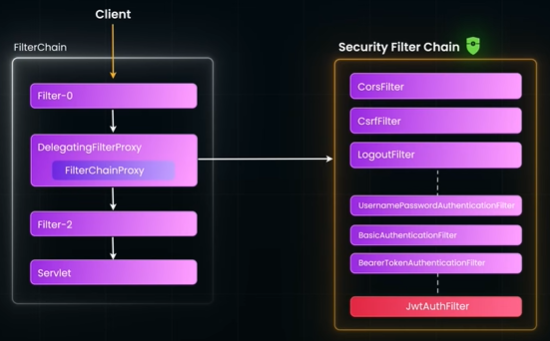

> - **security concepts** https://github.com/lekhrajdinkar/senior-system-engineer/tree/2026/docs/2022-2025/SE_02_distributed-system/SD_03_security
> - projects:
>   - [securityApp, **README.md**](../../WebSecurityModule/src/main/java/securityApp/README.md)

---
# Spring security
## Overview
- https://www.youtube.com/watch?v=nhsdPVXhbHo
- Spring Security seamlessly integrates with Spring Boot and Spring MVC app
- to handle various **security concerns**,
    - Authentication - login forms, Http basic Auth, JWT authentication
    - Authorization - Access-control, method based, rabc
- Annotations:
    - `@EnableWebSecurity`
    - `@EnableMethodSecurity`, `@PreAuthorize`, etc
        - also supports Spel
    - ...

## Filter Chain
- inspecting every request before it reaches the controller/servlet
- built-in:
    - authentication built-in filters
        - **Username Password Authentication Filter** , for form logins.
        - **Basic Authentication Filter**, for HTTP basic authentication.
        - **Bearer Token Authentication Filter** , for JWT token (Authorization Bearer token header)
        - ...
        - custom filters (plug-in and can change order)



---
## Authentications
### 💠default security
- Adding Spring Security **dependency**, secures the app by default.
- Every endpoint requires authentication, an auto-generated login form, and a default user with a random password
- can define your own in-memory users. `UserDetail`
```xml
<dependency>
            <groupId>org.springframework.boot</groupId>
            <artifactId>spring-boot-starter-security</artifactId>
</dependency>
```  
---
### 💠Authentication Flow – UserDetailsService & PasswordEncoder
> for traditional Web App
- User sends login credentials
- Spring Security filter captures the request
- **UserDetailsService**
    - An interface with a single method
    - that tells Spring how to find users
    - (e.g., from an in-memory store, database, or **external API**).
- **PasswordEncoder**
    - Defines how to compare the hashed password with the raw password provided by the user.
    - `BCrypt` is a secure hashing algorithm built into Spring
- If passwords match, authentication is successful;
    - a **security context** is created and stored
    - Every future request uses that context to verify access

---
### 💠OAuth2 login ✔️
**if act as `client`**
- Spring Security makes it easy to integrate **OAuth2 providers** (okta, Google, GitHub, Facebook).
- Redirect to authorization server and handle callback
```xml
 <dependency>
            <groupId>org.springframework.boot</groupId>
            <artifactId>spring-boot-starter-oauth2-client</artifactId>
</dependency>
```
```properties
# client-1 (registrationId : cc / client_credential)
# https://dev-16206041-admin.okta.com/admin/app/oidc_client/instance/0oaldbk7ys8px41Gy5d7/#tab-general
spring.security.oauth2.client.registration.cc.authorization-grant-type=client_credentials
spring.security.oauth2.client.registration.cc.client-id=
spring.security.oauth2.client.registration.cc.client-secret=
spring.security.oauth2.client.registration.cc.scope=app_read_lekhraj
spring.security.oauth2.client.provider.cc.token-uri=https://dev-16206041.okta.com/oauth2/ausldbxlfakbwq32P5d7/v1/token


# client-2 (registrationId : af_pkce / auth_code flow)
# ¸https://dev-16206041-admin.okta.com/admin/app/oidc_client/instance/0oa197csukFN7ZM1R5d7/#tab-general
spring.security.oauth2.client.registration.af_pkce.authorization-grant-type=authorization_code
spring.security.oauth2.client.registration.af_pkce.client-id=
spring.security.oauth2.client.registration.af_pkce.client-authentication-method=none
spring.security.oauth2.client.provider.af_pkce.issuer-uri=https://dev-16206041.okta.com/oauth2/default
spring.security.oauth2.client.registration.af_pkce.redirect-uri="{baseUrl}/login/oauth2/code/{registrationId}"
spring.security.oauth2.client.registration.af_pkce.scope=openid, profile, email
```

**if act as `Resource Server`**
```xml
        <dependency>
            <groupId>org.springframework.boot</groupId>
            <artifactId>spring-boot-starter-oauth2-client</artifactId>
        </dependency>
```

```properties
# validate token
spring.security.oauth2.resourceserver.jwt.issuer-uri=https://dev-16206041.okta.com/oauth2/ausldbxlfakbwq32P5d7
```