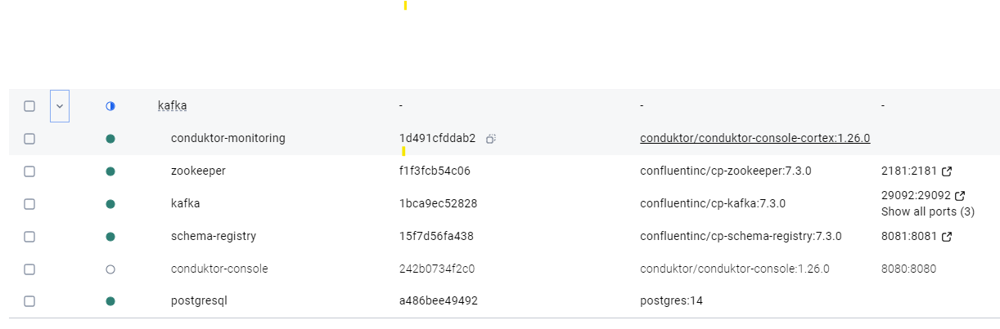
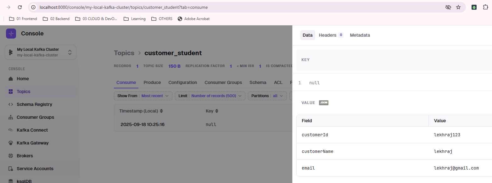

# Kafka Spring Example

## 1. Overview
This POC demonstrates Kafka basics and advanced patterns using:
- **Java Spring Boot** (producers, consumers, schema integration).
- **Confluent Schema Registry** for Avro schema-based messaging.

Topics used:
- `student-topic`
- `customer-topic`
- `generic-topic`

---
## 2. Environment Setup
### Docker Compose
- Kafka cluster + Zookeeper + Schema Registry + Conduktor Console already running.
- [docker-compose.yml](../../../../resources/more/kafka/docker-compose.yml)
- [platform-config.yml](../../../../resources/more/kafka/platform-config.yml)
- cluster name: `my-local-kafka-cluster`
- https://conduktor.io/get-started

```bash
cd ./../../../../../../src/main/resources/more/kafka
docker-compose -f docker-compose.yml up -d
```

- fix for cnductor-console 👈🏻
```yaml
  conduktor-console:
    image: conduktor/conduktor-console:1.26.0
    hostname: conduktor-console
    container_name: conduktor-console
    depends_on:
      - postgresql
    ports:
      - "8080:8080"
    volumes:
      - type: bind
        source: "/c/Users/Manisha/Documents/GitHub/idea/microservice-java/src/main/resources/more/kafka/platform-config.yml" # update this path 👈🏻👈🏻
        target: /opt/conduktor/platform-config.yaml
        read_only: true
    environment:
      CDK_IN_CONF_FILE: /opt/conduktor/platform-config.yaml
```

```text
[+] Running 7/7 ✅
 ✔ Network kafka_default           Created                                                                                                                                                                                 0.0s 
 ✔ Container zookeeper             Started                                                                                                                                                                                 1.6s 
 ✔ Container conduktor-monitoring  Started                                                                                                                                                                                 1.6s 
 ✔ Container postgresql            Started                                                                                                                                                                                 1.5s 
 ✔ Container conduktor-console     Started                                                                                                                                                                                 1.5s 
 ✔ Container kafka                 Started                                                                                                                                                                                 1.6s 
 ✔ Container schema-registry       Started
```



---
## kafkaSpringApp
### overview
  - [https://chatgpt.com/c/68cc4d40-7964-8333-86be-2846ae7979e8](https://chatgpt.com/c/68cc4d40-7964-8333-86be-2846ae7979e8)
  - main: [kafkaSpringApp.java](kafkaSpringApp.java)
  - docs: http://localhost:8091/kafkaSpringApp/swagger-ui/index.html
  - props: [kafkaSpringApp.properties](../../../../resources/more/kafka/kafkaSpringApp.properties)
  - conductor console: http://localhost:8080/console/my-local-kafka-cluster
  - [avro](../../../../resources/avro)
  - 
  
### Error and its Fix
```
🔶 Caused by: org.springframework.messaging.converter.MessageConversionException: 
Cannot convert from [org.apache.avro.generic.GenericData$Record] 
to [more.kafka.spring.avro.Student] for GenericMessage
✔️Fix : config.put(AbstractKafkaAvroSerDeConfig.SCHEMA_REGISTRY_URL_CONFIG, schemaRegistryUrl);

---
🔶 java.lang.IllegalStateException: Producer factory does not support transactions
✔️ Fix : config.put(ProducerConfig.TRANSACTIONAL_ID_CONFIG, "txn-producer-1");
```

### Producer Advance

```properties
# ✔️ Idempotent Producer
props.put(ProducerConfig.ENABLE_IDEMPOTENCE_CONFIG, true);
props.put(ProducerConfig.ACKS_CONFIG, "all");
props.put(ProducerConfig.RETRIES_CONFIG, 3);

# ✔️ Transactional Producer
Send messages atomically to multiple topics

props.put(ProducerConfig.TRANSACTIONAL_ID_CONFIG, "txn-id-1");

producer.initTransactions();
producer.beginTransaction();
producer.send(...);
producer.commitTransaction();

or

generic_kafkaTemplate.executeInTransaction(ops -> {
  ops.send("generic-topic", "dummy-message-step-1");
  ops.send("generic-topic", "dummy-message-step-2");
  //ops.send("generic-topic-2", "dummy-message-step-3");
  // ...
  return null;
});


# ✔️  Custom Partitioner
props.put(ProducerConfig.PARTITIONER_CLASS_CONFIG, "com.example.kafka.CustomPartitioner");

# ✔️ Batching & Compression
props.put(ProducerConfig.BATCH_SIZE_CONFIG, 32*1024); // 32 KB
props.put(ProducerConfig.LINGER_MS_CONFIG, 10);
props.put(ProducerConfig.COMPRESSION_TYPE_CONFIG, "snappy");

# ✔️Large Message Handling
on broker :
- Increase max.request.size & message.max.bytes .
- Optionally split large payloads into chunks.
- max 10 MB

# ✔️ Schema Evolution
- Register new Avro schema version with backward/forward compatibility.
- Producer sends using latest schema; consumer reads using previous schema if compatible.
```