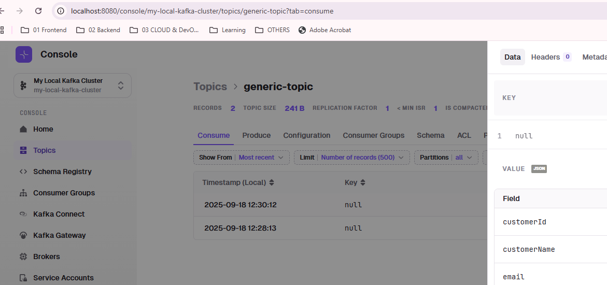

# Kafka Spring Example
## Run Kafka locally
- with Docker
- https://conduktor.io/get-started
```bash
cd ./../../../../../../src/main/resources/more/kafka
docker-compose -f docker-compose.yml up -d
```


- fix for cnductor-console
```bash
```yaml
  conduktor-console:
    image: conduktor/conduktor-console:1.26.0
    hostname: conduktor-console
    container_name: conduktor-console
    depends_on:
      - postgresql
    ports:
      - "8080:8080"
    volumes:
      - type: bind
        source: "/c/Users/Manisha/Documents/GitHub/idea/microservice-java/src/main/resources/more/kafka/platform-config.yml" # update this path 👈🏻👈🏻
        target: /opt/conduktor/platform-config.yaml
        read_only: true
    environment:
      CDK_IN_CONF_FILE: /opt/conduktor/platform-config.yaml

```

```text
[+] Running 7/7
 ✔ Network kafka_default           Created                                                                                                                                                                                 0.0s 
 ✔ Container zookeeper             Started                                                                                                                                                                                 1.6s 
 ✔ Container conduktor-monitoring  Started                                                                                                                                                                                 1.6s 
 ✔ Container postgresql            Started                                                                                                                                                                                 1.5s 
 ✔ Container conduktor-console     Started                                                                                                                                                                                 1.5s 
 ✔ Container kafka                 Started                                                                                                                                                                                 1.6s 
 ✔ Container schema-registry       Started
```

---
## Spring Boot Application
- **kafkaSpringApp**
  - main: [kafkaSpringApp.java](kafkaSpringApp.java)
  - docs: http://localhost:8091/kafkaSpringApp/swagger-ui/index.html
  - props: [kafkaSpringApp.properties](../../../../resources/more/kafka/kafkaSpringApp.properties)
  - conductor console: http://localhost:8080/console/my-local-kafka-cluster
  - 